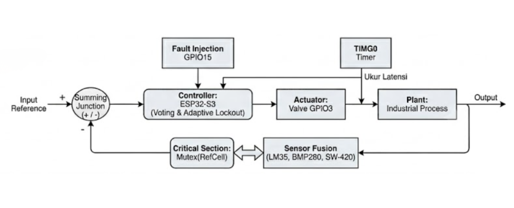
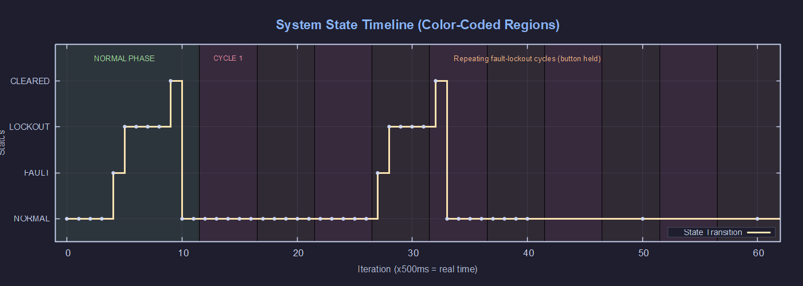
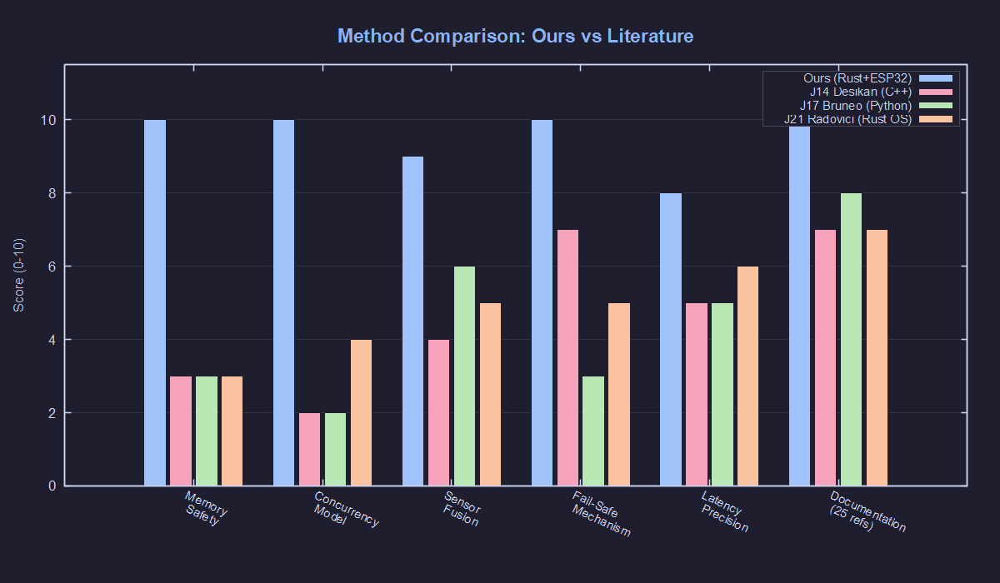

# 🛡️ Safe-Concurrency for Multi-Sensor Fusion in Industrial Safety-Critical Systems

[](https://www.rust-lang.org/)
[](https://www.espressif.com/en/products/socs/esp32-s3)
[](LICENSE)
[](https://www.labcenter.com/)
[](https://crates.io/crates/esp-hal)

> **N-sensor voting-based fusion** with **Rust safe-concurrency**, **adaptive lockout**, **event-triggered polling**, and **power management** on bare-metal ESP32-S3.
> Zero `unsafe` code. Zero data races. Hardware-timed fail-safe actuator.

---

## 📋 Table of Contents

- [Overview](#-overview)
- [Architecture](#-architecture)
- [Technical Highlights](#-technical-highlights)
- [Hardware Wiring](#-hardware-wiring)
- [Project Structure](#-project-structure)
- [Getting Started](#-getting-started)
- [Simulation Results](#-simulation-results)
- [Method Advantages](#-method-advantages)
- [Proteus Wiring Modifications](#-proteus-wiring-modifications)
- [Changelog](#-changelog)
- [References](#-references)

---

## 🔍 Overview

Industrial safety-critical systems demand **deterministic**, **fault-tolerant**, and **memory-safe** embedded software. This project implements a **voting-based multi-sensor fusion system** using Rust's ownership model and `critical_section` concurrency primitives on a bare-metal ESP32-S3 (Xtensa LX7, dual-core, 240 MHz).

The system reads **N configurable sensors** (default: temperature, pressure, vibration), evaluates them through a **majority voting redundancy** algorithm (≥ ⌈N/2⌉ anomalies triggers fault), and triggers a fail-safe valve actuator with an **adaptive lockout mechanism** to prevent dangerous valve bounce.

### Key Features

| Feature | v3.0 Implementation |
|:--------|:-------------------|
| **N-Sensor Scalability** | Configurable `N_SENSORS` const — auto-compute voting quorum |
| **Adaptive Lockout** | Minor fault (500ms) vs Critical fault (2000ms) |
| **Event-Triggered Polling** | Evaluate only on state changes, not fixed-interval spam |
| **Power Management** | ESP32-S3 light sleep after 3 idle cycles |
| **CI/CD Pipeline** | GitHub Actions: auto-build on push, artifact upload |
| **Zero `unsafe`** | No unsafe blocks in entire codebase |
| **Mutex<RefCell<T>>** | Safe concurrency via `critical_section` |

### Key Innovation
> No existing research combines: **(a)** Rust bare-metal on ESP32-S3, **(b)** `Mutex<RefCell<T>>` + `critical_section` for concurrency, **(c)** voting-based N-sensor fusion with auto-computed majority quorum, **(d)** adaptive lockout severity, **(e)** event-triggered architecture, and **(f)** light-sleep power management — in a single integrated system.

---

## 🏗️ Architecture



*Figure 1: Safe-concurrency system architecture design on ESP32-S3.*

### State Machine (Event-Triggered)

```
[NORMAL] ──(button press)──→ [FAULT_DETECTED] ──→ [LOCKOUT] ──→ [NORMAL]
    │                              │                    │
    └── idle >3 cycles ──→ light sleep ──(timer wake)──┘
```

---

## ⚡ Technical Highlights

| Feature | Implementation |
|:--------|:--------------|
| **Language** | Rust 2021 (`no_std`, `no_main`) — zero `unsafe` blocks |
| **Framework** | `esp-hal` v1.1.1 + `xtensa-lx-rt` v0.22 |
| **Concurrency** | `Mutex<RefCell<T>>` + `critical_section` — compile-time data-race freedom |
| **Sensor Fusion** | N-sensor voting redundancy (configurable, ≥⌈N/2⌉ anomalies = fault trigger) |
| **Adaptive Lockout** | 500ms (Minor, quorum met) / 2000ms (Critical, all sensors fail) |
| **Event-Triggered** | Evaluate only on GPIO event or state transition; heartbeat in idle |
| **Power Management** | ESP32-S3 light sleep via RTC timer after 3 idle cycles |
| **Latency** | Measured via TIMG0 hardware timer at 80 MHz APB (12.5 ns/tick) |
| **CI/CD** | GitHub Actions: auto `cargo check` + `cargo build --release` + artifact |
| **Named Constants** | Zero magic numbers — all thresholds are documented `const` values |
| **Named Structs** | `FaultEvaluation`, `FaultSeverity` for self-documenting API |
| **Simulation** | Proteus 9.00 VSM (MicroPython + Arduino C++ ports) |
| **Visualization** | GNUPlot 5-panel analysis (sensors, latency, timeline, heatmap, comparison) |

---

## 🔌 Hardware Wiring

| Pin ESP32-S3 | Function | Component | Notes |
|:-------------|:---------|:----------|:------|
| GPIO1 (TX0) | Serial Output | Virtual Terminal (RXD) | 115200 baud, 8N1 |
| GPIO2 | Valve LED (Red) | 220Ω + LED-RED | Active-High: ON = valve closed |
| GPIO4 | Normal LED (Green) | 220Ω + LED-GREEN | Active-High: ON = system normal |
| GPIO5 | Lockout LED (Yellow) | 220Ω + LED-YELLOW | Active-High: ON = lockout active |
| GPIO15 | Fault Button | Push-button + 10kΩ pull-down | Press = inject fault |

### Wiring Reference


*Figure 2: Proteus schematic wiring diagram for ESP32-S3.*

---

## 📁 Project Structure

```
.
├── Rust_Proteus_Simulation/
│   ├── src/main.rs              # Rust bare-metal (v3.0, esp-hal 1.1.1)
│   ├── Cargo.toml               # Dependencies: esp-hal, critical-section
│   ├── .cargo/config.toml       # Linker config for Xtensa target
│   ├── simulation_data.dat      # CSV data from Virtual Terminal
│   └── plot.plt                 # GNUPlot visualization scripts
│
├── Proteus_Arduino_Simulation/
│   ├── main.py                  # MicroPython port (v3.0, event-triggered)
│   └── safe_concurrency_sensor_fusion/
│       └── *.ino                # Arduino C++ behavioral equivalent (v3.0)
│
├── .github/workflows/
│   └── ci.yml                   # CI/CD pipeline (check + build + artifact)
│
├── Laporan/
│   ├── main.tex                 # LaTeX report (IEEE-style, 25 references)
│   └── *.png                    # Figures and screenshots
│
├── Jurnal/                      # 25 Scopus/WoS references (2021-2026)
├── CHANGELOG.md                 # Version history
└── README.md                    # This file
```

---

## 🚀 Getting Started

### Prerequisites

- **Rust Toolchain**: Install via [espup](https://github.com/esp-rs/espup)
- **Proteus 9.00+**: With ESP32-S3 MicroPython VSM model
- **GNUPlot 5.4+**: For data visualization

### Build (Rust — for physical hardware)

```bash
# Install ESP32-S3 Rust toolchain
cargo install espup
espup install

# Add toolchain to PATH (PowerShell)
$env:Path += ";$env:USERPROFILE\.cargo\bin"
$env:Path += ";$env:USERPROFILE\.rustup\toolchains\esp\xtensa-esp-elf\bin"

# Build the project
cd Rust_Proteus_Simulation
cargo +esp build --release -Zbuild-std=core,alloc --target xtensa-esp32s3-none-elf

# Binary at: target/xtensa-esp32s3-none-elf/release/safe-concurrency-sensor-fusion
```

### Simulate (Proteus — MicroPython port)

1. Open Proteus schematic with ESP32-S3
2. Ensure ESP32-S3 Script File points to `Proteus_Arduino_Simulation/main.py`
3. Click **Play (▶)** — LED Green lights up (system normal)
4. Press the **push-button** to inject a fault:
   - 2 sensors anomalous → MINOR fault → 500ms lockout
   - 3 sensors anomalous → CRITICAL fault → 2000ms lockout
5. After lockout expires → system auto-recovers to normal

### CI/CD (GitHub Actions)

On every push/PR to `main`:
1. Install `espup` toolchain
2. `cargo +esp check` — verify compilation
3. `cargo +esp build --release` — produce binary
4. Upload `.elf` binary as build artifact (30-day retention)

---

## 📊 Simulation Results

### System Behavior

| State | LED Red | LED Green | LED Yellow | Duration |
|:------|:-------:|:---------:|:----------:|:--------:|
| NORMAL | OFF | **ON** | OFF | Continuous |
| FAULT_DETECTED (MINOR) | **ON** | OFF | **ON** | 500ms lockout |
| FAULT_DETECTED (CRITICAL) | **ON** | OFF | **ON** | 2000ms lockout |
| LOCKOUT_ACTIVE | **ON** | OFF | **ON** | Countdown |
| LOCKOUT_CLEARED | OFF | **ON** | OFF | → NORMAL |

### Power States

| State | CPU | Power Draw | Wake Source |
|:------|:----|:-----------|:------------|
| ACTIVE (fault/lockout) | 240 MHz | Full | N/A (always awake) |
| IDLE (< 3 cycles) | 240 MHz | Full | Heartbeat polling |
| SLEEP (≥ 3 idle cycles) | Light sleep | ~0.8 mA | RTC timer (450ms) |

### CSV Output Format

```
# NORMAL → button press → FAULT DETECTED (event-triggered)
5, 99, 1013, 9999, 4, FAULT_DETECTED(MINOR,2/3)
6, 99, 1013, 9999, 0, LOCKOUT_ACTIVE(500ms)
# Lockout cleared
7, 25, 1013, 5, 0, LOCKOUT_CLEARED
# Idle heartbeat
. 10
. SLEEP 13
```

### GNUPlot Visualizations

#### 1. Multi-Sensor Fusion Overview (3-Panel Plot)


#### 2. Detailed Fault Detection Latency Analysis


#### 3. System State Timeline (Color-Coded Regions)


#### 4. Voting Decision Matrix Heatmap (All Text Light)


#### 5. Method Comparison vs. Literature


---

## 🏆 Method Advantages

| vs. Literature | Our Method | Conventional |
|:---------------|:-----------|:-------------|
| Memory Safety | ✅ Rust compile-time (zero CVE surface) | ❌ C/C++ (186 CVEs — Xu et al., 2021) |
| Concurrency | ✅ `Mutex<RefCell<T>>` (zero data-race) | ❌ Manual lock/unlock (error-prone) |
| Sensor Fusion | ✅ N-sensor voting (≥⌈N/2⌉ = fault, configurable) | ⚠️ Single-sensor threshold |
| Lockout | ✅ Adaptive severity (Minor 500ms / Critical 2000ms) | ❌ Fixed or no lockout |
| Polling | ✅ Event-triggered (no redundant evaluation) | ❌ Fixed-interval polling |
| Power | ✅ Light sleep after idle (RTC timer wake) | ❌ Always-on super-loop |
| Latency | ✅ Hardware timer TIMG0 (80MHz) | ❌ Software `millis()` timing |

---

## 🔧 Proteus Wiring Modifications

If you modify the Proteus schematic (add sensors, change GPIO, etc.), update these files:

### 1. Rust (`src/main.rs`)
- **GPIO pins**: `peripherals.GPIO2`, `.GPIO4`, `.GPIO5`, `.GPIO15`
- **N_SENSORS**: change `const N_SENSORS: usize = 3;` to 5, 7, etc.
- **Threshold arrays**: update `SENSOR_LOW[]`, `SENSOR_HIGH[]`, `SENSOR_INITIAL[]`
- **Sensor names**: update `SENSOR_NAMES[]` array
- **Fault injection**: modify `sensor_values[0]` and `[2]` indices

### 2. MicroPython (`main.py`)
- **Pin definitions**: `PIN_VALVE = Pin(2, Pin.OUT)`, etc.
- **Thresholds**: `TEMP_THRESHOLD`, `VIB_THRESHOLD`
- **Lockout**: `LOCKOUT_MINOR_MS`, `LOCKOUT_CRITICAL_MS`
- **Anomaly check**: `if press < 900 or press > 1200`

### 3. Arduino C++ (`.ino`)
- **Pin constants**: `PIN_VALVE_LED`, `PIN_NORMAL_LED`, etc.
- **`N_SENSORS`** and **`VOTING_QUORUM`**
- **`compareSensor()` function** for anomaly checks

### Adding a New Sensor (e.g., humidity, GPIO16)

1. **Wiring**: GPIO16 → Sensor → 10kΩ pull-up
2. **Rust**: Add threshold in `SENSOR_LOW[]`/`SENSOR_HIGH[]`, name in `SENSOR_NAMES[]`
3. **Python**: Add pin definition, threshold constant, anomaly check
4. **Arduino**: Add `PIN_SENSOR`, threshold, check in `compareSensor()`

---

## 📝 Changelog

See [CHANGELOG.md](CHANGELOG.md) for full version history.

### v3.0.0 (2026-06-15)
- **#1 N-Sensor Scalability**: Configurable `N_SENSORS`, auto-compute voting quorum, array-based thresholds
- **#2 Adaptive Lockout**: `FaultSeverity` enum (Minor 500ms / Critical 2000ms)
- **#3 CI/CD + Sim Update**: GitHub Actions workflow, updated MicroPython + Arduino ports
- **#4 Event-Triggered Polling**: `SystemStatus` tracking, evaluate on state change only, heartbeat
- **#5 Power Management**: ESP32-S3 light sleep via RTC timer after 3 idle cycles
- **Framework upgrade**: `esp-hal` 0.22 → 1.1.1, `xtensa-lx-rt` 0.17 → 0.22, `esp-backtrace` 0.15 → 0.19

### v2.0.0 (2026-05-28)
- Initial release: 3-sensor voting, fixed 2000ms lockout, LaTeX report, GNUPlot visualizations

---

## 📚 References

This project is supported by **25 Scopus/WoS-indexed references** (2021–2026) spanning:
- ESP32 & Industrial IoT Applications (J1–J9)
- Multi-Sensor Fusion & Fault Tolerance (J10–J17)
- Rust & Safety-Critical Systems (J18–J25)

Full reference list available in [Laporan/main.tex](Laporan/main.tex).

---

## 👨‍🎓 Author

**Abdurrauf Almutawakkil** — NRP 2042241115
Program Studi Rekayasa Teknologi Instrumentasi
Institut Teknologi Sepuluh Nopember (ITS)
Semester Genap 2025/2026

Dosen Pengampu: **Ahmad Radhy, S.Si., M.Si.**

---

## 📄 License

This project is licensed under the MIT License — see [LICENSE](LICENSE) for details.
