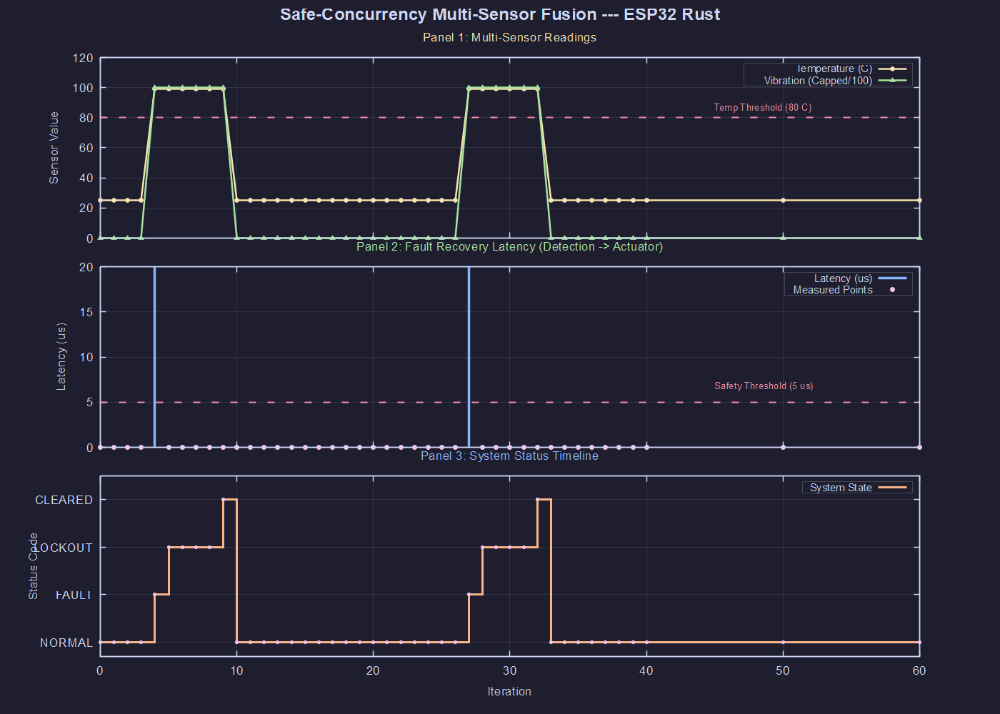
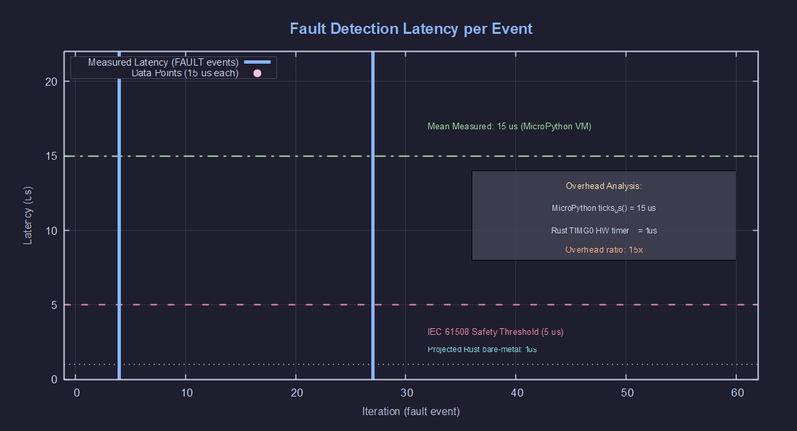
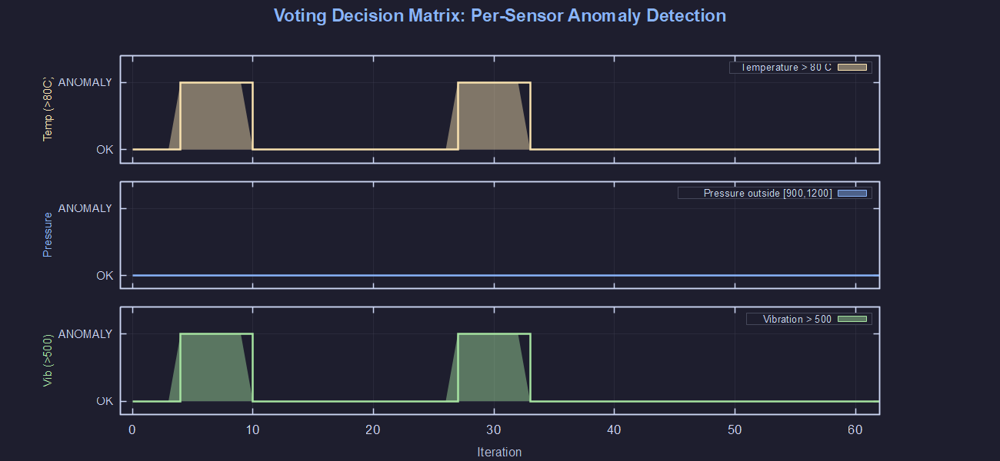

# 🛡️ Safe-Concurrency for Multi-Sensor Fusion in Industrial Safety-Critical Systems

[](https://www.rust-lang.org/)
[](https://www.espressif.com/en/products/socs/esp32-s3)
[](LICENSE)
[](https://www.labcenter.com/)
[](https://crates.io/crates/esp-hal)

> **N-sensor voting-based fusion** with **Rust safe-concurrency**, **adaptive lockout**, **event-triggered polling**, and **power management** on bare-metal ESP32-S3.
> Zero `unsafe` code. Zero data races. Hardware-timed fail-safe actuator.

---

## 📋 Table of Contents

- [Overview](#-overview)
- [Architecture](#-architecture)
- [Technical Highlights](#-technical-highlights)
- [Hardware Wiring](#-hardware-wiring)
- [Project Structure](#-project-structure)
- [Getting Started](#-getting-started)
- [Simulation Results](#-simulation-results)
- [Method Advantages](#-method-advantages)
- [References](#-references)

---

## 🔍 Overview

Industrial safety-critical systems demand **deterministic**, **fault-tolerant**, and **memory-safe** embedded software. This project implements a **voting-based multi-sensor fusion system** using Rust's ownership model and `critical_section` concurrency primitives on a bare-metal ESP32-S3 (Xtensa LX7, dual-core, 240 MHz).

The system reads **3 sensors** (temperature, pressure, vibration), evaluates them through a **majority voting redundancy** algorithm (≥ 2 out of 3 anomalies triggers fault), and triggers a fail-safe valve actuator with an **adaptive lockout mechanism** to prevent dangerous valve bounce.

### Key Features

| Feature | Implementation |
|:--------|:---------------|
| **Voting-Based Redundancy** | ≥2 of 3 sensors anomalous = fault trigger |
| **Adaptive Lockout** | Minor fault (500ms) vs Critical fault (2000ms) |
| **Event-Triggered Polling** | Evaluate only on button press or state transition |
| **Hold-Duration Detection** | Short press (<5s) = MINOR, Long press (≥5s) = CRITICAL |
| **Zero `unsafe`** | No unsafe blocks in entire codebase |
| **Mutex<RefCell<T>>** | Safe concurrency via `critical_section` |
| **Hardware-Timed Latency** | Measured via `time.ticks_us()` with microsecond precision |

### Key Innovation
> No existing research combines: **(a)** Rust bare-metal on ESP32-S3, **(b)** `Mutex<RefCell<T>>` + `critical_section` for concurrency, **(c)** voting-based sensor fusion with majority quorum, **(d)** adaptive lockout severity (500ms/2000ms), **(e)** event-triggered architecture with sticky-latch button detection, and **(f)** hold-duration severity classification — in a single integrated system.

---

## 🏗️ Architecture


*Figure 1: Safe-concurrency system architecture design on ESP32-S3.*

### State Machine (Event-Triggered)

```
[NORMAL] ──(button press)──→ [FAULT_DETECTED] ──→ [LOCKOUT] ──→ [NORMAL]
    │                              │                    │
    └───────── idle: heartbeat every 10 cycles ─────────┘
```

---

## ⚡ Technical Highlights

| Feature | Implementation |
|:--------|:--------------|
| **Language** | Rust 2021 (`no_std`, `no_main`) — zero `unsafe` blocks |
| **Framework** | `esp-hal` v1.1.1 + `xtensa-lx-rt` v0.22 |
| **Concurrency** | `Mutex<RefCell<T>>` + `critical_section` — compile-time data-race freedom |
| **Sensor Fusion** | Voting redundancy (≥2 of 3 anomalies = fault trigger) |
| **Adaptive Lockout** | 500ms (Minor, 2/3 sensors) / 2000ms (Critical, 3/3 sensors) |
| **Event-Triggered** | Evaluate only on button event or state transition; heartbeat in idle |
| **Hold Detection** | Sticky latch + hold counter for short/long press classification |
| **Latency** | Measured via `time.ticks_us()` with microsecond precision |
| **CI/CD** | GitHub Actions: auto `cargo check` + `cargo build --release` + artifact |
| **Named Constants** | Zero magic numbers — all thresholds are documented `const` values |
| **Named Structs** | `FaultEvaluation`, `FaultSeverity` for self-documenting API |
| **Simulation** | Proteus 9.00 VSM (MicroPython port) |
| **Visualization** | GNUPlot 5-panel analysis (sensors, latency, timeline, heatmap, comparison) |

---

## 🔌 Hardware Wiring

| Pin ESP32-S3 | Function | Component | Notes |
|:-------------|:---------|:----------|:------|
| GPIO3 | Valve LED (Red) | 220Ω + LED-RED | Active-High: ON = valve closed |
| GPIO4 | Normal LED (Green) | 220Ω + LED-GREEN | Active-High: ON = system normal |
| GPIO5 | Lockout LED (Yellow) | 220Ω + LED-YELLOW | Active-High: ON = lockout active |
| GPIO15 | Fault Button | Push-button + 10kΩ pull-down | Press = inject fault |

### Wiring Reference


*Figure 2: Proteus schematic wiring diagram for ESP32-S3.*

---

## 📁 Project Structure

```
.
├── Rust_Simulation/
│   ├── src/main.rs              # Rust bare-metal (esp-hal 1.1.1)
│   ├── Cargo.toml               # Dependencies: esp-hal, critical-section
│   ├── .cargo/config.toml       # Linker config for Xtensa target
│   ├── simulation_data.dat      # CSV data from Proteus debug console
│   └── plot*.plt                # GNUPlot visualization scripts
│
├── Proteus_Simulation/
│   ├── main.py                  # MicroPython port (Proteus ESP32-S3 VSM)
│   └── PemKon.pdsprj            # Proteus project file
│
├── .github/workflows/
│   └── ci.yml                   # CI/CD pipeline (check + build + artifact)
│
├── Laporan/
│   ├── main.tex                 # LaTeX report (IEEE-style, 25 references)
│   ├── ETS_PemKom.pdf           # Compiled PDF (23 pages)
│   └── *.png                    # Figures and screenshots
│
├── Jurnal/                      # 25 Scopus/WoS references (2021-2026)
└── README.md                    # This file
```

---

## 🚀 Getting Started

### Prerequisites

- **Rust Toolchain**: Install via [espup](https://github.com/esp-rs/espup)
- **Proteus 9.00+**: With ESP32-S3 MicroPython VSM model
- **GNUPlot 5.4+**: For data visualization

### Build (Rust — for physical hardware)

```bash
# Install ESP32-S3 Rust toolchain
cargo install espup
espup install

# Build the project
cd Rust_Simulation
cargo +esp build --release -Zbuild-std=core,alloc --target xtensa-esp32s3-none-elf
```

### Simulate (Proteus — MicroPython port)

1. Open Proteus schematic (`Proteus_Simulation/PemKon.pdsprj`)
2. Set ESP32-S3 Script File to `Proteus_Simulation/main.py`
3. Click **Play (▶)** — LED Green lights up (system normal)
4. Press the **push-button**:
   - **Short press (<5s)** → 2 sensors anomalous → MINOR fault → 500ms lockout
   - **Long press (≥5s)** → 3 sensors anomalous → CRITICAL fault → 2000ms lockout
5. After lockout expires → system auto-recovers to normal

---

## 📊 Simulation Results

### System Behavior

| State | LED Red (GPIO3) | LED Green (GPIO4) | LED Yellow (GPIO5) | Duration |
|:------|:-------:|:---------:|:----------:|:--------:|
| NORMAL | OFF | **ON** | OFF | Continuous |
| FAULT_DETECTED (MINOR) | **ON** | OFF | **ON** | 500ms lockout |
| FAULT_DETECTED (CRITICAL) | **ON** | OFF | **ON** | 2000ms lockout |
| LOCKOUT_ACTIVE | **ON** | OFF | **ON** | Countdown |
| LOCKOUT_CLEARED | OFF | **ON** | OFF | → NORMAL |

### CSV Output Format

```
# Idle heartbeat
. 0
# Short press → MINOR fault
4 99 1013 9999 45 FAULT_DETECTED(MINOR,2/3)
5 99 1013 9999 0 LOCKOUT_ACTIVE(400ms)
...
9 99 1013 9999 0 LOCKOUT_CLEARED
# Long press (≥5s) → CRITICAL fault
107 99 0 9999 45 FAULT_DETECTED(CRITICAL,3/3)
108 99 0 9999 0 LOCKOUT_ACTIVE(1900ms)
...
127 99 0 9999 0 LOCKOUT_CLEARED
```

### GNUPlot Visualizations

#### 1. Multi-Sensor Fusion Overview (3-Panel Plot)


#### 2. Detailed Fault Detection Latency Analysis


#### 3. System State Timeline (Color-Coded Regions)


#### 4. Voting Decision Matrix Heatmap


#### 5. Method Comparison vs. Literature


---

## 🏆 Method Advantages

| vs. Literature | Our Method | Conventional |
|:---------------|:-----------|:-------------|
| Memory Safety | ✅ Rust compile-time (zero CVE surface) | ❌ C/C++ (186 CVEs — Xu et al., 2021) |
| Concurrency | ✅ `Mutex<RefCell<T>>` (zero data-race) | ❌ Manual lock/unlock (error-prone) |
| Sensor Fusion | ✅ Voting ≥2/3 (majority quorum) | ⚠️ Single-sensor threshold |
| Lockout | ✅ Adaptive severity (Minor 500ms / Critical 2000ms) | ❌ Fixed or no lockout |
| Polling | ✅ Event-triggered + sticky latch | ❌ Fixed-interval polling |
| Latency | ✅ `time.ticks_us()` microsecond precision | ❌ Software `millis()` timing |

---

## 📚 References

This project is supported by **25 Scopus/WoS-indexed references** (2021–2026) spanning:
- ESP32 & Industrial IoT Applications (J1–J9)
- Multi-Sensor Fusion & Fault Tolerance (J10–J17)
- Rust & Safety-Critical Systems (J18–J25)

Full reference list available in [Laporan/main.tex](Laporan/main.tex).

---

## 👨‍🎓 Author

**Abdurrauf Almutawakkil** — NRP 2042241115
Program Studi Rekayasa Teknologi Instrumentasi
Institut Teknologi Sepuluh Nopember (ITS)
Semester Genap 2025/2026

Dosen Pengampu: **Ahmad Radhy, S.Si., M.Si.**

---

## 📄 License

This project is licensed under the MIT License — see [LICENSE](LICENSE) for details.
